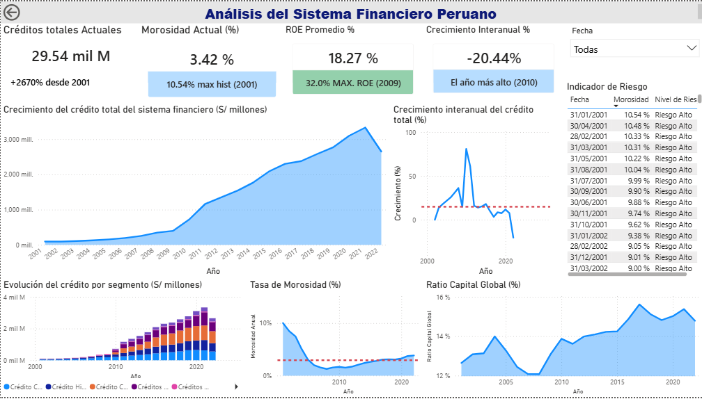

# 📊 Análisis de Créditos del Sistema Financiero (2001–2022)

Proyecto de análisis de datos financieros utilizando Python, SQL Server y Power BI para explorar la evolución de los créditos del sistema financiero y analizar su crecimiento a lo largo del tiempo.

---

## 📌 Objetivo del proyecto

Analizar la evolución de los créditos del sistema financiero entre 2001 y 2022, identificando tendencias de crecimiento, variaciones interanuales y la participación de distintos tipos de crédito.

---

## 🗂 Dataset

Fuente: Reporte histórico del sistema financiero.

Periodo analizado: **2001 – 2022**

Variables principales:

- Créditos de consumo
- Créditos hipotecarios
- Créditos corporativos
- Créditos a medianas empresas
- Morosidad

---

## ⚙️ Metodología

El proyecto se desarrolló en tres etapas principales:

### 1. Limpieza y transformación de datos (Python)

Se utilizó Python y la librería Pandas para preparar el dataset.

Principales tareas realizadas:

- Carga de datos desde archivo CSV
- Corrección de problemas de codificación
- Manejo de valores nulos
- Conversión de tipos de datos
- Preparación del dataset para análisis

```python
import pandas as pd

df = pd.read_csv("dataset_creditos.csv")

df["creditos_totales"] = (
    df["creditos_consumo"] +
    df["creditos_hipotecarios"] +
    df["creditos_corporativos"] +
    df["creditos_medianas"]
)

df["anio"] = pd.to_datetime(df["fecha"]).dt.year
```
---

### 2. Análisis de datos (SQL Server)

Se realizaron consultas analíticas para explorar el comportamiento del crédito.

Principales análisis:

- Cálculo de créditos totales por año
- Análisis de crecimiento interanual
- Creación de vistas para facilitar el análisis

Ejemplo de consulta:

```sql
SELECT 
    YEAR(FECHA) AS ANIO,
    SUM(
        ISNULL(CREDITOS_CONSUMO,0) +
        ISNULL(CREDITOS_HIPOTECARIOS,0) +
        ISNULL(CREDITOS_CORPORATIVOS,0) +
        ISNULL(CREDITOS_MEDIANAS,0)
    ) AS CREDITOS_TOTALES
FROM CREDITOS
GROUP BY YEAR(FECHA)
```
---

### 3. Dashboard (Power BI)
El dashboard fue desarrollado en Power BI para visualizar de forma interactiva la evolución de los créditos del sistema financiero durante el periodo analizado.

El panel permite analizar:

- Evolución de los créditos totales a lo largo del tiempo
- Crecimiento histórico del crédito desde el año base
- Comparación entre distintos tipos de crédito
- Distribución del crédito por segmento

Principales visualizaciones incluidas:

- Gráfico de línea con la evolución de los créditos totales
- Indicador de crecimiento histórico
- Gráfico comparativo por tipo de crédito
- Tarjetas con métricas clave del sistema financiero



---

## 💻 Código del proyecto

El código utilizado en el análisis se encuentra disponible en el repositorio.

### Python – Limpieza de datos

[Ver script de limpieza en Python](python_clean_sbs.py)

### SQL – Consultas de análisis

[Ver consultas SQL](consultas_analisis_sbs.sql)

---

## 🛠 Tecnologías utilizadas

Las herramientas utilizadas en el desarrollo del proyecto fueron:

- **Python** – Limpieza y transformación de datos (Pandas)
- **SQL Server** – Consultas analíticas y creación de vistas
- **Power BI** – Visualización y desarrollo del dashboard
- **Excel / CSV** – Fuente inicial del dataset

---
## 📁 Estructura del repositorio

```
analisis-creditos-sistema-financiero
│
├── README.md
├── python_clean_sbs.py
├── consultas_analisis_sbs.sql
└── dashboard_sbs.png
```

---

## 📊 Conclusiones

A partir del análisis realizado se identificaron las siguientes observaciones:

-  Los créditos totales muestran una tendencia creciente desde 2001, alcanzando su pico máximo de crecimiento en 2010.
- Los créditos corporativos y créditos de medianas empresas representan una parte significativa de los créditos totales en los últimos años.
- La tasa de morosidad actual representa un riesgo medio en la evolución de créditos.

Este tipo de análisis permite comprender la evolución del crédito en el sistema financiero y facilita la identificación de tendencias relevantes para la toma de decisiones y el análisis económico.
